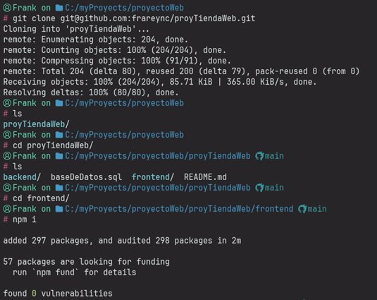
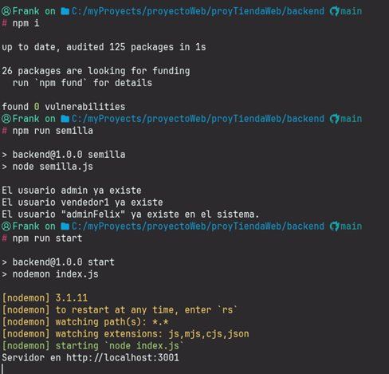
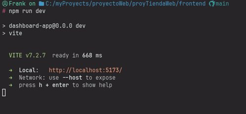
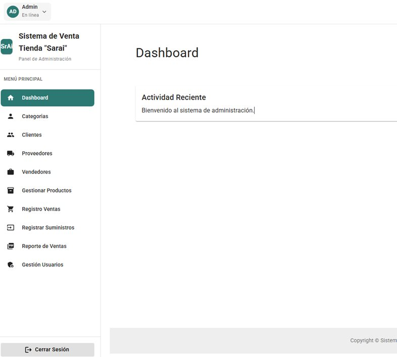

# PROYECTO PROGRAMACION WEB III
### SISTEMA DE CONTROL DE VENTAS PARA LA TIENDA SARAI
#### INTEGRANTES
- Frank Reynaldo Nina Cortez
- Cristian Rodrigo Marca Lima

Grupo 8 Segun revision del auxiliar

##### Instrucciones
1. Clonar el repositorio
2. Crear la BD de acuerdo al archivo sql
3. instalar paquetes tanto de frontend como de backend

   

4. en backend ejecutar el script:
  - npm run semilla
  - creara el usuario para ingresar al login:
  - usuario: admin
  - password: admin123
  - segundo usuario
  - usuario: adminFelix
  - password: felix123

       

5. ejecutar tanto el backend como frontend
  - backend
  - npm run start
  - frontend
  - npm run dev

       

6. en backend modificar el archivo db.js
  - en mi caso el usuario de mysql se encuentra con contraseña.
  - en caso de usar xampp el usuario de mysql se encuentra sin contraseña.
  - borrar la contraseña en el archivo db.js root
7. ingresar :http://localhost:5173/
  - autenticarse con:
  - admin
  - admin123
  - o usar el otro usuario

       

       
